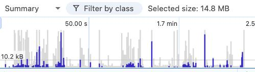

# Отчёт об утечках памяти (Memory Leaks)

## Статус
На текущий момент в проекте не обнаружено утечек памяти.

## Методика проверки

Для анализа использовались:

1. **Chrome DevTools → Memory**:
   - `Allocation Timeline` — запись выделений памяти при навигации между страницами.
   - `Heap Snapshot` — сравнение состояния памяти до и после размонтирования компонентов.

## Подробное описание

На графике Allocation Timeline видны два типа столбцов:

Серые — это временные выделения памяти. Программа их использует, а потом система очистки (GC, Garbage Collector) благополучно удаляет. Это нормальное, здоровое поведение.

Синие — это объекты, которые остались в памяти к концу записи. Именно они могут сигнализировать о возможной утечке.

В самом начале (при запуске приложения) синие столбцы есть — это нормально. Программа инициализируется, загружает нужные данные, создаёт объекты.
Дальше синие столбцы почти не видны или очень малы — значит, новых «долгоживущих» объектов почти не появляется.
Самое важное: при повторении одних и тех же действий синие столбцы не растут.

По снимку (Heap Snapshot) состояние памяти не увеличилось после размонтирования

Система очистки (GC) работает корректно — освобождает временную память.
Поведение приложения здоровое: память не «забивается» при повторных действиях.

## Какие повторные действия были выполнены

1. Запуск игры
2. Авторизация
3. Выход
4. Переход по страницам
5. Изменение информации пользователя