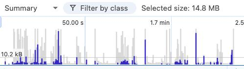

# Memory Leaks Report

## Status
No memory leaks have been found in the project so far.

## Testing methodology

The following was used for analysis:

1. **Chrome DevTools → Memory**:
   - `Allocation Timeline` — recording memory allocations while navigating between pages.
   - `Heap Snapshot` — comparing memory state before and after unmounting components.

## Detailed description

The Allocation Timeline graph shows two types of bars:

Gray bars are temporary memory allocations. The program uses them, and then the cleanup system (GC, Garbage Collector) successfully removes them. This is normal, healthy behavior.

Blue bars are objects that remained in memory by the end of the recording. These are the ones that can signal a possible leak.

At the very beginning (when the app starts), blue bars are present — this is normal. The program initializes, loads the necessary data, and creates objects.
After that, blue bars are barely visible or very small — meaning almost no new "long-lived" objects are appearing.
Most importantly: when the same actions are repeated, the blue bars do not grow.

According to the snapshot (Heap Snapshot), memory usage did not increase after unmounting.

The cleanup system (GC) works correctly — it frees temporary memory.
The application behaves in a healthy way: memory does not get clogged up from repeated actions.

## Which repeated actions were performed

1. Starting the game
2. Logging in
3. Logging out
4. Navigating between pages
5. Changing user information
